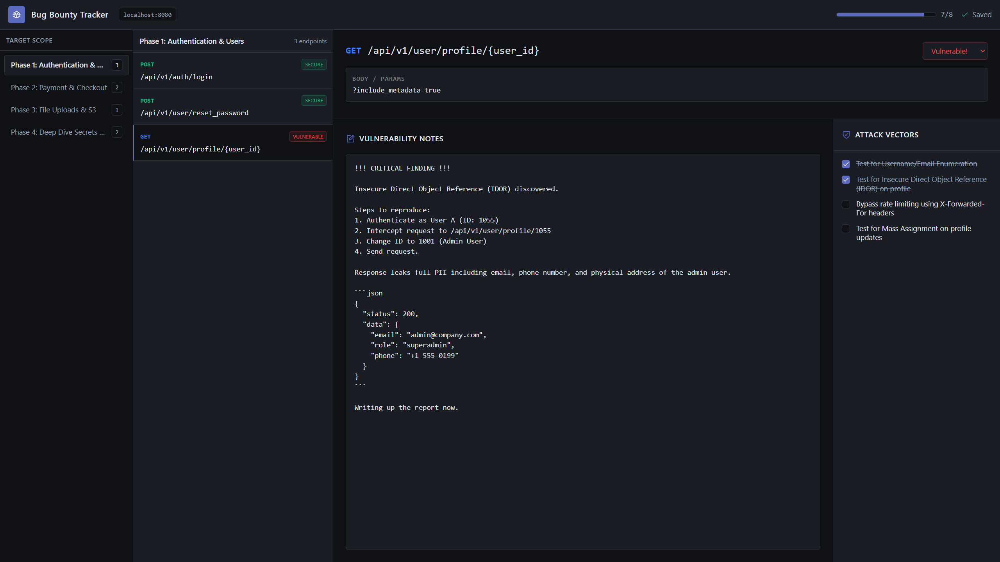

# 🕷️ OpenCode JS Bounty Hunter Plugin

[](https://www.npmjs.com/package/opencode-js-bounty)
[](https://opensource.org/licenses/MIT)
[](https://opencode.ai)
[](https://twitter.com/spxios)



An official OpenCode plugin that automatically downloads js files, analyzes them for hidden API endpoints and local storage secrets, and spins up a beautiful local Bug Bounty Tracker UI to manage your hunt!

## Installation

1. Add the plugin to your OpenCode project by editing opencode.json:

```json
{
  "$schema": "https://opencode.ai/config.json",
  "plugin": ["opencode-js-bounty"]
}
```

2. Run `npm install opencode-js-bounty` (or whatever your package manager uses to install it locally).

*Note: The installation process will automatically register the /js-bounty command into your OpenCode CLI via a post-install hook.*

## Usage

Simply trigger the analysis inside OpenCode by passing a local file path or a remote URL:

```bash
/js-bounty https://example.com/assets/file.js
```

**What happens next?**
1. OpenCode seamlessly intercepts the command and downloads the file.
2. The plugin executes a high-speed extraction script, aggressively pulling out all \`/api/*\`, \`/v1/*\`, and \`/jwt/*\` paths, along with cached \`llab-*\` secrets.
3. The data is saved to \`tracker-state.json\`.
4. A stealthy local UI server boots up at **http://localhost:49152**.
5. OpenCode replies with a single link to click. No terminal clutter!

## Features
- **Zero Configuration**: Just pass a URL and get a full dashboard.
- **Plannotator-Style UI**: A dark-mode, split-pane React application built-in.
- **Persistent State**: Notes, statuses, and checkboxes are instantly saved to disk locally.
- **Auto-Categorization**: Automatically separates hidden localStorage keys from standard REST APIs.

---

## Author & Support
Created with ❤️ by **[Ahmed Yasser](https://github.com/spxios)**

If this tool helped you secure a sweet bounty, consider starring the repo or reaching out on [Twitter/X (@spxios)](https://twitter.com/spxios)!
